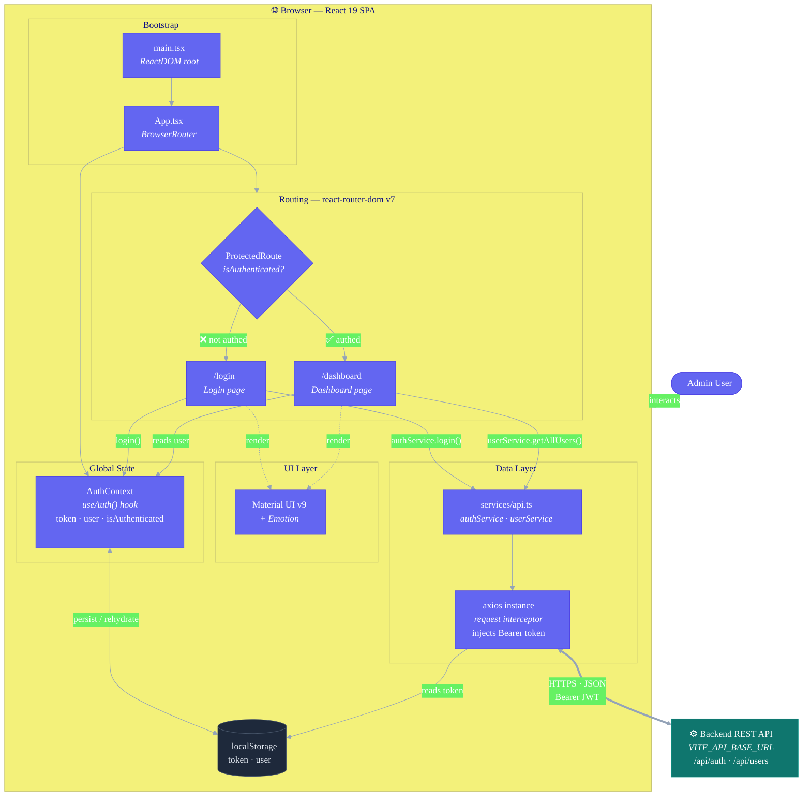

# Ezequiel Torres Art Manager

Admin dashboard for managing the Ezequiel Torres Art portfolio.

## Architecture



**Request flow:** the user authenticates via the `Login` page → `AuthContext` stores the JWT in `localStorage` → `ProtectedRoute` unlocks `/dashboard` → page components call `authService`/`userService`, whose shared axios instance auto-injects the `Bearer` token on every request to the backend REST API.

**Tech Stack:**
- React 19 + TypeScript
- Vite (build tool)
- Material UI (components)
- React Router (navigation)
- Axios (HTTP client)

## Getting Started

### Prerequisites
- Node.js 18+
- Backend running at `http://localhost:3000` (see `VITE_API_BASE_URL` in `.env`)

### Installation

```bash
npm install
```

### Environment Variables

Copy `.env.example` to `.env` and configure:

```env
VITE_API_BASE_URL=http://localhost:3000
```

### Development

```bash
npm run dev
```

Server runs at `http://localhost:5173`

**Demo credentials:**
- Email: `admin@example.com`
- Password: `admin123`

### Build

```bash
npm run build
npm run preview  # Preview the production build locally
```

## Project Structure

```
src/
├── pages/           # Page components (Login, Dashboard)
├── components/      # Reusable components (ProtectedRoute)
├── context/         # React Context (AuthContext)
├── services/        # API client (Axios + endpoints)
├── types/           # TypeScript types
└── App.tsx          # Main router
```

## Features

- ✅ Login/Logout with JWT
- ✅ Protected routes (redirect to login if not authenticated)
- ✅ Users table (list all users)
- ✅ Material UI theming
- ✅ Auto token injection in requests

## Next Steps

- [ ] User CRUD (Create, Edit, Delete)
- [ ] Artworks management
- [ ] Gallery editor
- [ ] User role management
